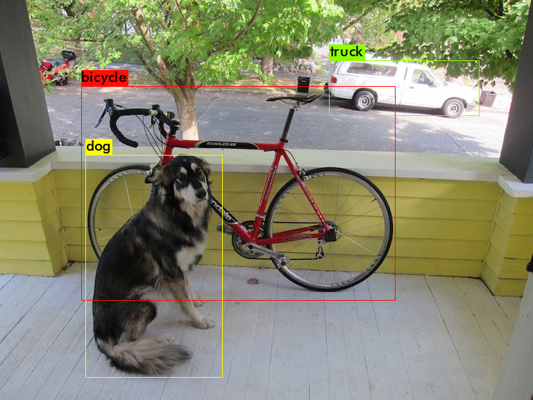
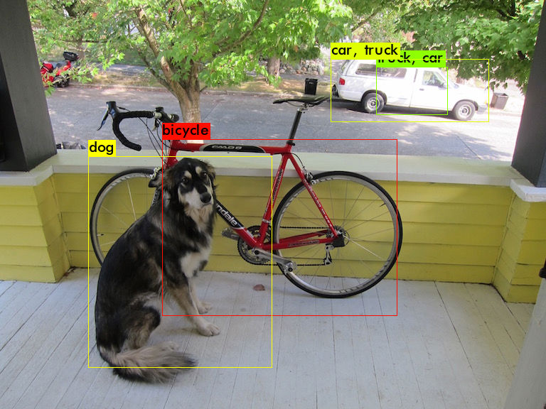

## Raspberry Pi 3 Version 2

## Operating System
- Raspbian Buster with desktop
- Tested Ubuntu Server 20.04 64bits (Trying to resolve the Bus error, it's extremely slow and hard to setup)

## Optimized version of darknet
https://github.com/AlexeyAB/darknet

| Models |yolov3 | tiny-yolov3 |
|:------:|:------:|:------:|
| Network Layers | 107 | 24 |
| Class | 80 | 80 |
| Time | 402.46s (6.7min) | 34.82s (0.56min) |
| Prediction |   |  |

- Note
  - Need to add yolov3_ssig(License Plate) to the table.
  - Need to test the Python Wrapper

### Tested not working
#### Original darknet
https://github.com/pjreddie/darknet

- Segmentation fault when loading a yolov3 model, Raspberry Pi 3 doesn't have enough memory.
- Got Bus error on prediction stage, after loading a tiny-yolov3 model. Not sure what cause this error.

#### Darknet-nnpack
https://github.com/digitalbrain79/darknet-nnpack

- Darknet with [NNPACK](https://github.com/Maratyszcza/NNPACK) acceleration. Getting error when compiling. Haven't got it working yet, might come back later.
